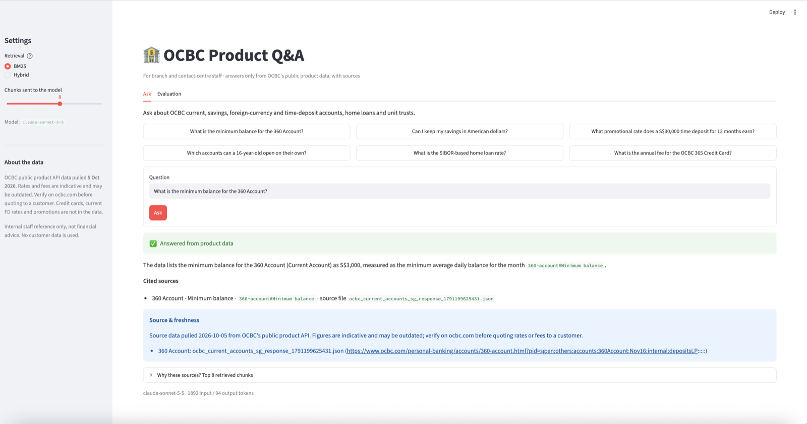
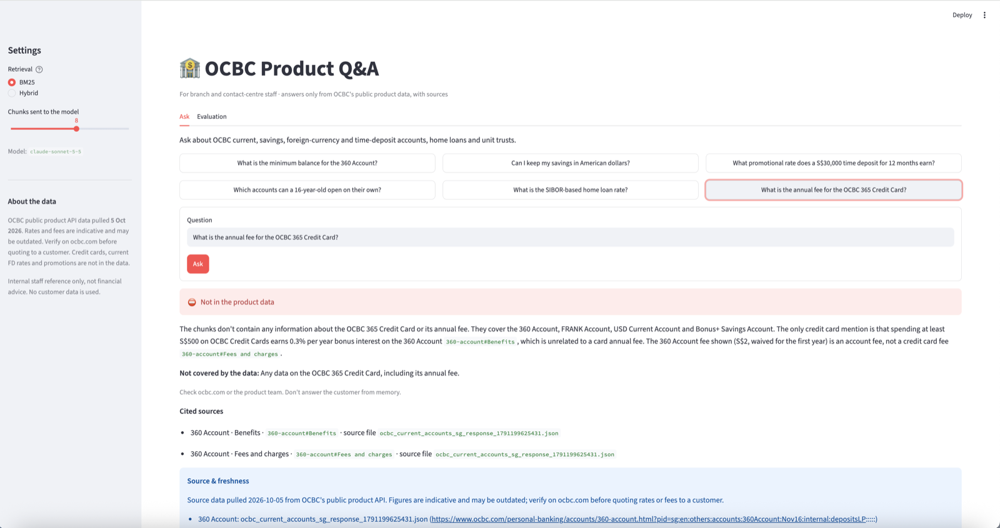
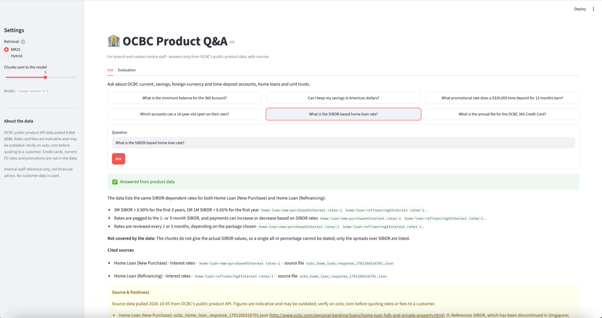
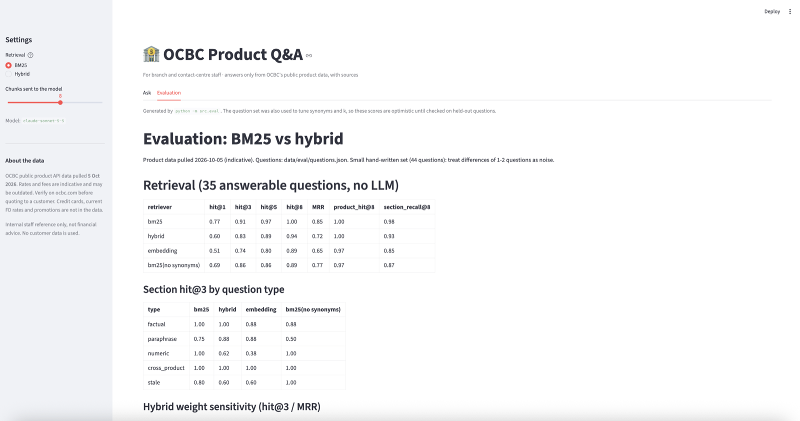
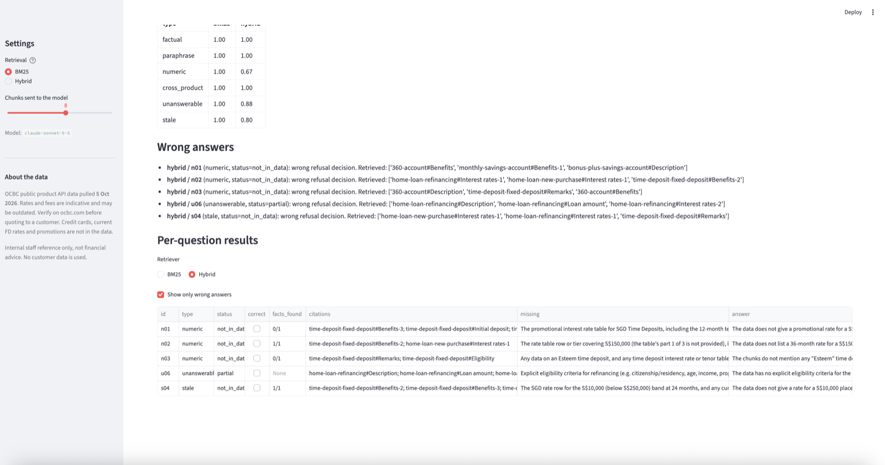

# OCBC Product Q&A (prototype)

A staff-facing Q&A assistant over OCBC's public product data. It answers only from retrieved product sections, cites
`product_name` and `source_file`, refuses when the data doesn't cover the question, and adds a source-and-freshness
note to every answer.

> **Unofficial prototype.** Not affiliated with or endorsed by OCBC. Product data comes from OCBC's public API
> (Connect2OCBC), pulled 5 Oct 2026, which marks it *indicative and subject to change*. Rates and fees may be
> outdated: don't rely on them. No customer data is used.



<details>
<summary>More screenshots: refusal, stale data, evaluation</summary>

**Refusing when the data doesn't cover it** (credit cards aren't in the data):



**Flagging stale data** (SIBOR has been discontinued):



**Evaluation tab:** retrieval metrics, then wrong answers and per-question results:




</details>

## How it works
1. **Clean:** `scripts/clean_products.py` turns the raw API JSON in `data/ocbc_products/` into one schema in
   `data/products_clean/`, with a [data-quality report](data/products_clean/DATA_QUALITY.md).
2. **Retrieve:** product documents are split into sections and searched with BM25 plus a banking synonym list (the
   default). Optional: model2vec embeddings, or a BM25 + embedding hybrid (Reciprocal Rank Fusion).
3. **Answer:** Claude answers from the retrieved sections only and returns structured output: a status (answered,
   partial or not in data), the answer, citations and what's missing. Citations are checked against what was
   retrieved. Sections that look stale (SIBOR, promotions, "as of" dates) are flagged.
4. **Fail safely:** if the API errors or times out, the app shows the top 3 sections, labelled "AI answer unavailable".

## Results
44 hand-written questions (factual, paraphrase, numeric, cross-product, unanswerable, stale), from
[`data/eval/SUMMARY.md`](data/eval/SUMMARY.md):

| | BM25 (default) | Hybrid |
|---|---|---|
| Retrieval hit@3 (35 answerable) | 0.91 | 0.83 |
| Answers correct (all 44) | 1.00 | 0.89 |
| Refusal precision | 1.00 | 0.67 |

**These numbers are optimistic.** The same questions were used to tune the synonyms and k, so they need a held-out
question set written by someone else. Grading is substring matching, not human review.

## Run it
Python 3.11 and an [Anthropic API key](https://console.anthropic.com/).

```bash
python3.11 -m venv .venv && source .venv/bin/activate
pip install -r requirements.txt
echo 'ANTHROPIC_API_KEY=your-key-here' > .env   # gitignored; never commit it

streamlit run app.py                   # the app: Ask and Evaluation tabs
python -m src.core "What is the minimum balance for the 360 Account?"   # one question in the terminal
python -m src.eval --retrieval-only    # retrieval evaluation, no API calls
python -m src.eval                     # full evaluation: ~88 Claude calls, about US$0.70
```

Without a key, the app still runs: every question gets the "AI answer unavailable" view with the top retrieved
sections. The model defaults to `claude-sonnet-5-5`; set `OCBC_QA_MODEL` to change it.

## Files
| File | What it does |
|---|---|
| `app.py` | Streamlit UI. |
| `src/core.py` | Chunking, stale flags, BM25, embeddings, hybrid retrieval, Claude answering. |
| `src/eval.py` | Retrieval and answer metrics → `data/eval/SUMMARY.md` and CSVs. |
| `src/data_gen.py` | One readable document per product (`data/docs/`). |
| `scripts/clean_products.py` | Raw API JSON → clean data and data-quality report. |
| `data/eval/questions.json` | The evaluation questions. |

See [`HANDOFF.md`](HANDOFF.md) for assumptions, known shortcuts and what productionising would take.
